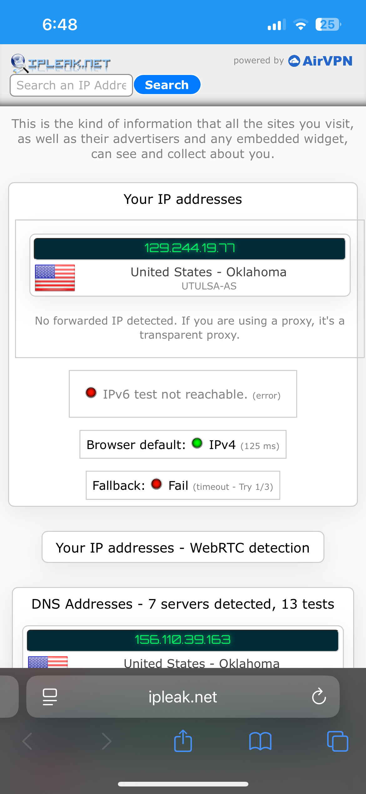
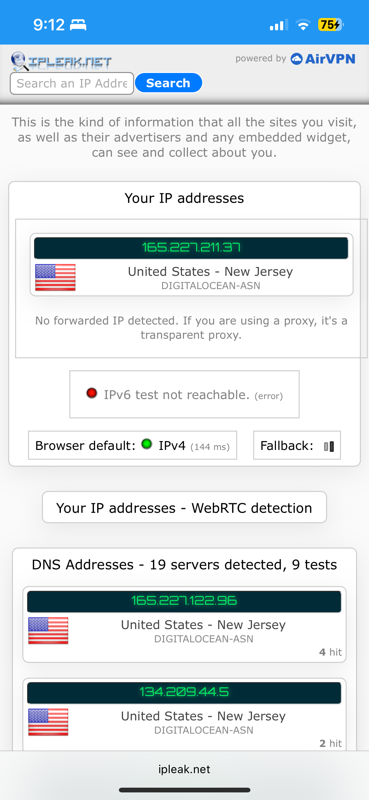
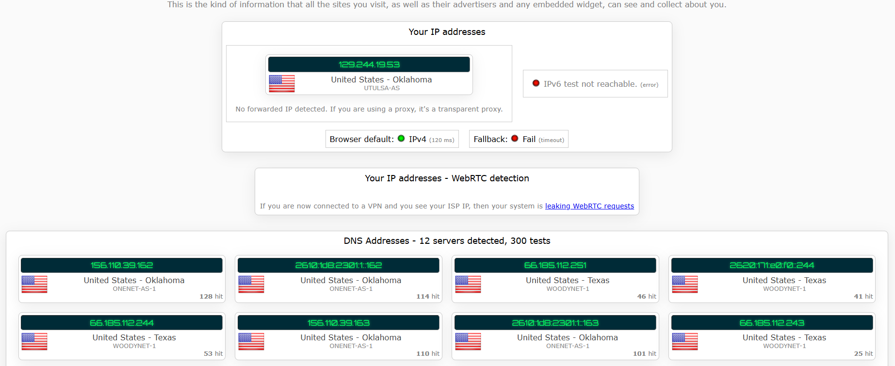
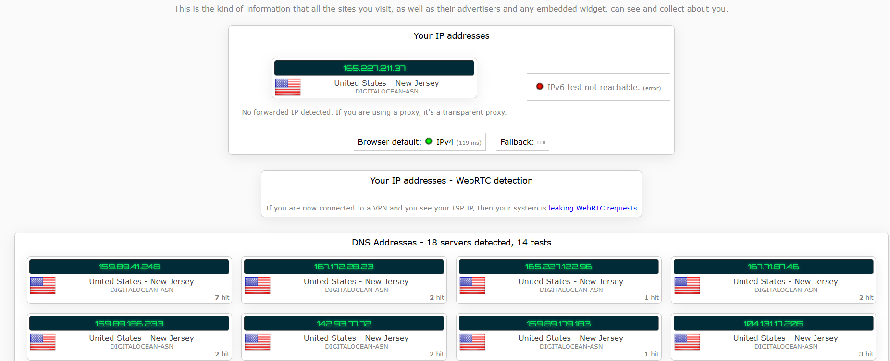

# Project 3: Wireguard VPN
This is documentation on how to create a Wireguard VPN within a Linux Digital Ocean Droplet with Docker. 

## Create a Digital Ocean Droplet
To create a Digital Ocean Droplet, you need to have an account with Digital Ocean. A paid option was used in this documentation. However, Digital Ocean does have sign-up credits which will cover the cost for a limited time. The specific configuration applied on the droplet was: Ubuntu 24.04, Basic CPU and SSD, and the $6/month paid tier. 

Before accessing the droplet, the access configuration has to be setup. Either a password can be set up or an ssh key. An ssh key was used for this instance. To do this, access the terminal on a local machine and run 

    ssh-keygen

This will prompt you with two follow up questions which you can press enter for both of them. Run this to get public key

    cat <path to public key>

Enter this into the Digital Ocean ssh key option, allowing for the droplet to be ssh accessible.

## Access Droplet 
To access droplet, run

    ssh -i "<path to private key>" root@<Droplet IP>

The droplet ip can be found by navigating to the Digital Ocean dashboard and selecting the project which the droplet was created in. The ip should be following the name of the droplet.

**ENSURE TO SUCCESSFULLY SSH INTO DROPLET BEFORE CONTINUING WITH THE DOCUMENTATION 

## Install Docker
Once you have ssh into the droplet, install docker and docker compose by following [Docker Installation](dockerProject.md).

## Install Wireguard
To install wireguard, first create directory and cd into it

    mkdir wireguard
    cd wireguard

Write the docker compose file that will create the wireguard instance with docker

    nano docker-compose.yml

Copy and paste this into the text editor

        version: "3.8"
        services:
            wireguard:
                image: linuxserver/wireguard
                container_name: wireguard
                cap_add:
                    - NET_ADMIN
                    - SYS_MODULE
                environment:
                    - PUID=1000
                    - PGID=1000
                    - TZ=America/Chicago
                    - SERVERURL=<Droplet IP>
                    - SERVERPORT=51820
                    - PEERS=1
                    - PEERDNS=auto
                    - INTERNAL_SUBNET=10.13.13.0
                volumes:
                    - ./config:/config
                    - /lib/modules:/lib/modules
                ports:
                    - 51820:51820/udp
                sysctls:
                    - net.ipv4.conf.all.src_valid_mark=1
                restart: unless-stopped

To forward the traffic from port 80 to the port 51820, ensure iptables is intstalled

    sudo iptables --version

Run this command to

    iptables -t nat -A PREROUTING -p udp --dport 80 -j REDIRECT --to-port 51820

To ensure port forward is enabled on the system, find the

    net.ipv4.ip_forward = 1

in 

    sudo nano /etc/sysctl.conf

Then apply changes with

    sudo sysctl -p

Run the Wireguard VPN while in the `wireguard` folder with

    docker compose up -d

Terminate with 

    docker compose down 

## Access Wireguard VPN
After the container is ran, configuration files are generated which allow for the vpn to be accessed

For mobile, download the app and access the QR code from the `config` folder within the `wireguard` folder. The QR can not be displayed from the droplet console, so it has to be accessed from a local machine. One way to do that is run this in a terminal on your local machine  

    scp -i "<path to private key> root@<Droplet IP>:~/wireguard/congfig/peer1 <destination folder>

The destination folder is wherever you want the download to be on your local machine. 

In this folder the QR code is labeled `peer1.png`. Open and scan it in the app. Here is an example of the VPN being used on a mobile device. The home IP:

The VPN IP:

Additionally, the the .conf in the `peer1` folder can be used to access the VPN. Here is an example on a PC: 

The VPN IP:

